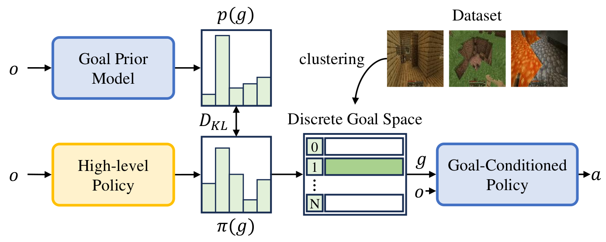

# Pre-Training Goal-based Models for Sample Efficient Reinforcement Learning

Environment used: Ubuntu 20.04.3 LTS with Python 3.9.12.

Installation steps:
```
git clone https://github.com/latentghost/PTGM-Sample-Efficient-RL
cd PTGM-Sample-Efficient-RL
pip install setuptools==65.5.0 pip==21
pip install wheel==0.38.0
pip install -r requirements.txt
cd ..
wget https://github.com/hmsjy2017/get-jdk/releases/download/v8u231/jdk-8u231-linux-x64.tar.gz
tar -xvzf jdk-8u231-linux-x64.tar.gz
export JAVA_HOME=~/jdk1.8.0_231
export PATH="$JAVA_HOME/bin:$PATH"
pip install minedojo
pip install git+https://github.com/MineDojo/MineCLIP
pip uninstall minedojo 
git clone https://github.com/PKU-RL/MCEnv
cd MCEnv
python setup.py install
cd ..
cd PTGM-Sample-Efficient-RL
pip install --upgrade --no-cache-dir gdown
bash download.sh
```


Reports with WandB results:


# Pre-Training Goal-based Models for Sample-Efficient Reinforcement Learning

Based on the [[Paper]](https://openreview.net/forum?id=o2IEmeLL9r) at **ICLR 2024 (oral)**. 
Here is the [[Project Page]](https://sites.google.com/view/ptgm-iclr).




PTGM is a novel task-agnostic pre-training method that pre-trains goal-based models to accelerate downstream RL. PTGM involves pre-training a low-level, goal-conditioned policy and training a high-level policy to generate goals for subsequent RL tasks. To address the challenges posed by the high-dimensional goal space, while simultaneously maintaining the agent's capability to accomplish various skills, we propose clustering goals in the dataset to form a discrete high-level action space. Additionally, a goal prior model is pre-trained to regularize the behavior of the high-level policy in RL, enhancing sample efficiency and learning stability. 

## Installation

- Create a conda environment with `python==3.9.12`. Install python packages in `requirements.txt`.

- Install Java: JDK `1.8.0_171`. Then install the [MineDojo](https://github.com/MineDojo/MineDojo) environment and [MineCLIP](https://github.com/MineDojo/MineCLIP) following their official documents.

- Upgrade the MineDojo package:
  - `pip uninstall minedojo`.
  - Install the [upgraded MineDojo](https://github.com/PKU-RL/MCEnv).
 

- Download pre-trained models for MineCraft: run `bash downloads.sh` to download the MineCLIP model and the VPT-2x model.


## Download and pre-process the dataset
```
python steve1/data/generation/convert_from_contractor.py \
--batch_size 32 \
--num_episodes -1 \
--worker_id 0 \
--output_dir downloads/dataset_contractor/ \
--index  8.x \
--min_timesteps 1 \
--start_idx 0
```
Set `--index` to 8.x, 9.x, 10.x respectively to download the three subsets of the contractor dataset. 

Split training and validation set:
```
python steve1/data/sampling/generate_sampling.py \
--output_dir downloads/samplings \
--val_frames 10_000 \
--train_frames 30_000_000
```
If you do not download the whole dataset, set `--train_frames` to the actual number of frames for training.

Cluster the MineCLIP embeddings of observations to acquire a discrete high-level action space:
```
python goal_prior/generate_codebook.py \
--embedding tsne \
--n-codebook 100
```

## Pre-train goal-based models 
- Train the goal-conditioned policy: run `bash steve1/train_goal_conditioned_policy.sh`.

- Train the goal prior model: run `bash goal_prior/train_goal_prior.sh`.

**If you don't want to download the dataset and train from scratch**, download the pre-trained models and goal clusters [here](https://disk.pku.edu.cn/link/AAFD7852E16FFB43E09FB2BD34E7B41E7B).


## Train high-level policies for downstream tasks with PPO

Train for "cobblestone" as an example:
```
python ppo_highlevel.py \
--config cobblestone \
--name ppo_highlevel_log \
--discrete \
--goal_prior \
--kl_reward 0.05 \
--low_level_steps 100 \
--steps_per_iter 40 \
--steps 15000 \
--in_weights $PATH_TO_YOUR_GOAL_CONDITIONED_POLICY.weights \
--prior_weights $PATH_TO_YOUR_GOAL_PRIOR_MODEL.weights \
--codebook $PATH_TO_YOUR_GOAL_CLUSTERS.pkl 
```

`--config` specifies the task. All tasks in the paper are `log_plains, water_bucket, cobblestone, iron_ore, spider`. Task configurations are in `tasks/task_specs.yaml`.


## Citation
Our implementation is based on the [code](https://github.com/PKU-RL/PTGM) from the authors of that paper, please cite their paper if you use any part of this code.
```bibtex
@inproceedings{
yuan2024pretraining,
title={Pre-Training Goal-based Models for Sample-Efficient Reinforcement Learning},
author={Haoqi Yuan and Zhancun Mu and Feiyang Xie and Zongqing Lu},
booktitle={The Twelfth International Conference on Learning Representations},
year={2024},
url={https://openreview.net/forum?id=o2IEmeLL9r}
}
```
